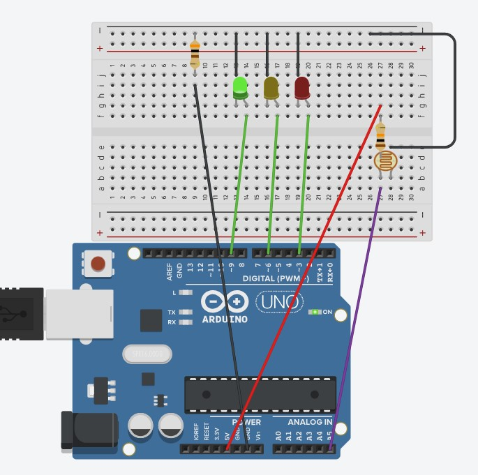

# Parte 1 Blink Led Interno Arduino
&emsp;Este repositório contém um projeto fictício para o Departamento de Engenharia de Trânsito, no qual existe a responsabilidade de controlar o fluxo em uma via movimentada do bairro Butantã. É um desenvolvimento de um sistema essencial para o controle de trânsito. Possui montagem e programação.

&emsp;O componente liga/desliga implementado no semáforo foi um fotorresistor (LDR), que altera o tempo em que os LEDs ficam nas cores vermelha e amarela. O objetivo dessa adição ao circuito de um semáforo foi adaptar o sistema para uma quantidade menor de carros à noite. Ou seja, quando o sensor fotorresistor (LDR) recebe uma quantidade menor de luz, os LEDs amarelo e vermelho permanecem ligados por menos tempo durante o ciclo de repetição. Quando há mais luz, os LEDs vermelho e amarelo ficam ligados por uma duração maior no ciclo. Dessa forma, à noite, o semáforo permaneceria mais tempo na cor verde, permitindo que os carros passassem mais rapidamente.

### Link para montagem no TinkerCad
https://www.tinkercad.com/things/lElMNhOxEpK/editel?returnTo=%2Fdashboard&sharecode=bZMrlL_730aEIuRvaHc0a3jeqbOX347LaeW4uB6D1BM

### Montagem no TinkerCad
<div align="center">
    
    <br>
    <sup>Imagem do Semáforo 1 - Fonte: TinkerCAD</sup>
</div>

### Montagem Física
**Demonstração da montagem com o fotorresistor exposto**
<div align="center">

https://github.com/user-attachments/assets/d7006ab1-b66e-425f-9853-2340c5c6c058

<sup>Vídeo do Semáforo 1 - Fonte: Material produzido pelos autores (2024) </sup>
</div>

**Demonstração da montagem com o fotorresistor descoberto**
<div align="center">

https://github.com/user-attachments/assets/f988987d-2b96-448c-9bf1-91da3ae3b77e

<sup>Vídeo do Semáforo 2 - Fonte: Material produzido pelos autores (2024)</sup>
</div>

### Código
Aqui está o código:
``` C++
// Definindo os pinos dos LEDs
int ledVerde = 9;
int ledAmarelo = 6;
int ledVermelho = 3;
int ldrPin = A5; // Pino do sensor LDR

void setup() {
  // Inicia a comunicação serial e configura os pinos dos LEDs como saída
  Serial.begin(9600);
  pinMode(ledVerde, OUTPUT);
  pinMode(ledAmarelo, OUTPUT);
  pinMode(ledVermelho, OUTPUT);
  //pinMode(ldrPin, INPUT);
}

void loop() {
  // Leitura do valor do sensor LDR
  int LDR = analogRead(ldrPin);
  Serial.print("Luminosidade: ");
  Serial.println(LDR);

  if (LDR > 250) {
    // Quando a luminosidade está baixa, executa a sequência do semáforo
    digitalWrite(ledVermelho, HIGH);
    delay(1000);
    digitalWrite(ledVermelho, LOW);
  
    digitalWrite(ledAmarelo, HIGH);
    delay(1000);
    digitalWrite(ledAmarelo, LOW);

    digitalWrite(ledVerde, HIGH);
    delay(4000);
    digitalWrite(ledVerde, LOW);

    digitalWrite(ledAmarelo, HIGH);
    delay(1000);
    digitalWrite(ledAmarelo, LOW);

  } else {
    // Quando a luminosidade está alta, executa a sequência do semáforo
    digitalWrite(ledVermelho, HIGH);
    delay(6000);
    digitalWrite(ledVermelho, LOW);
  
    digitalWrite(ledAmarelo, HIGH);
    delay(2000);
    digitalWrite(ledAmarelo, LOW);
  
    digitalWrite(ledVerde, HIGH);
    delay(4000);
    digitalWrite(ledVerde, LOW);

    digitalWrite(ledAmarelo, HIGH);
    delay(2000);
    digitalWrite(ledAmarelo, LOW);
  }
}

```

### Testando Protótipo (Vídeo)


